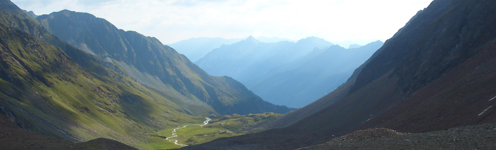

<!-- markdownlint-disable MD033 MD041 -->

### Hi, I'm Markus 👋

I mostly use GitHub just to get notifications from subscribed projects. My personal projects are hosted in a private [Forgejo](https://forgejo.org) instance and on [GitLab](https://gitlab.com/malfter). In my free time I try to support projects from [kamapu.net](https://kamapu.net).

You can find my website (or better said my link collection 😊) [here](https://alfter-web.de/).

My preferred operating system is Linux/Debian, and I am also a friend of open-source software #floss. If you want to contact me you can find me on [Mastodon](https://chaos.social/@markusalfter).

<!--
**malfter/malfter** is a ✨ _special_ ✨ repository because its `README.md` (this file) appears on your GitHub profile.

Here are some ideas to get you started:

- 🔭 I’m currently working on ...
- 🌱 I’m currently learning ...
- 👯 I’m looking to collaborate on ...
- 🤔 I’m looking for help with ...
- 💬 Ask me about ...
- 📫 How to reach me: ...
- 😄 Pronouns: ...
- ⚡ Fun fact: ...
-->
